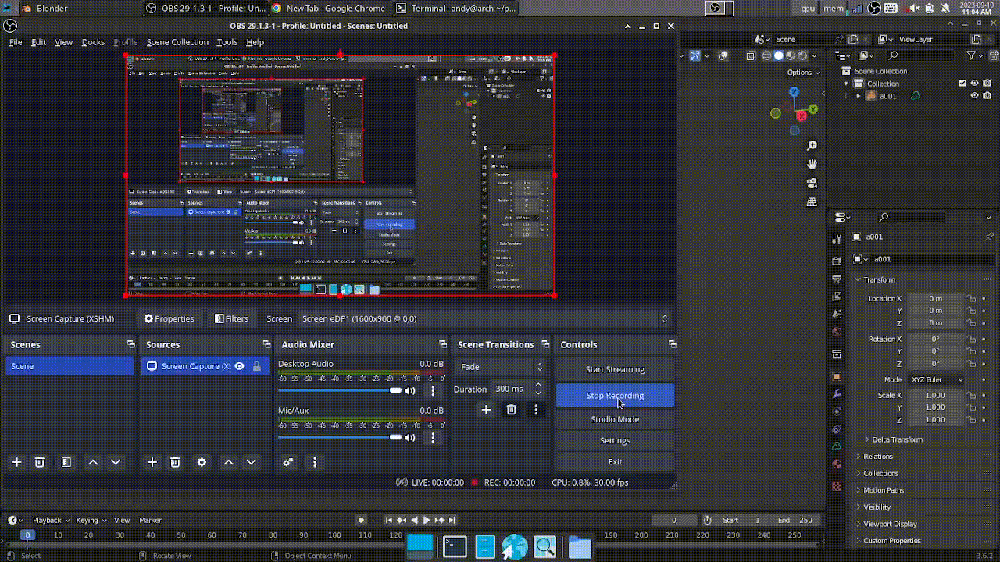

# Smoke Simulation Demo

This is a small demo for learning`GAMES103`, `GAMES201` and `CUDA`.

## Usage

To run this demo, please follow these steps:

1. Clone or download this repository;
2. Change the settings of `CUDA` in `CMakeLists.txt`.

## Features

1. Input of `.obj` file, mesh voxelization; (TODO)
2. Implement Semi-Lagrangian convection using trilinear interpolation with high performance CUDA texture.
3. Use Red-Black Gausian-Seidel to implement the projection.

## Credits

Special thanks to [彭于斌](https://github.com/archibate) for his wonderful courses in the `Parallel101` series.
